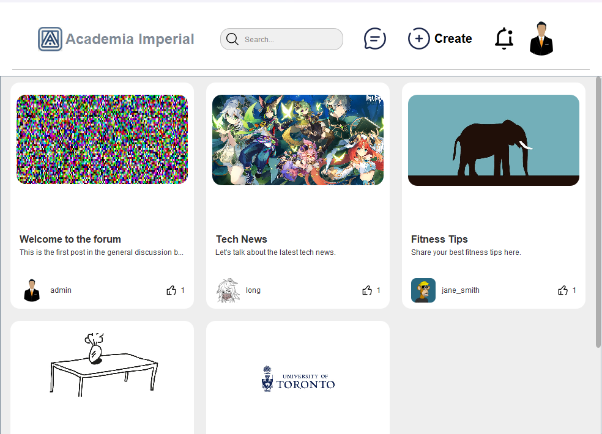
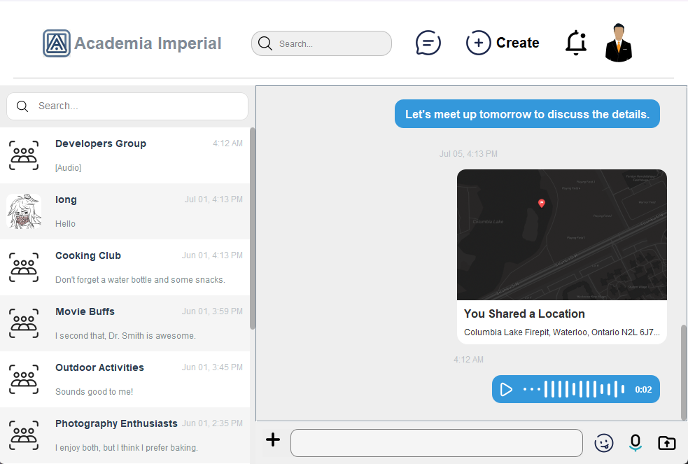

# CSC207 Campus Forum - Academia Imperial

## Table of Contents

1. [Overview](#overview)
2. [Features](#features)
3. [Technology Stack](#technology-stack)
4. [Domain Entities](#domain-entities)
5. [APIs](#apis)
6. [Installation and Setup](#installation-and-setup)
7. [Usage](#usage)
8. [Contributors](#contributors)
9. [Contribution Guidelines](#contribution-guidelines)
10. [License](#license)
11. [Contact](#contact)

## Overview
Academia Imperial's Campus Forum is a user-friendly and inclusive platform designed for students and faculty to discuss, share resources, post announcements, and exchange information about events. The forum is built with extensibility in mind, allowing for the easy addition of new features.





## Features

1. **Advanced Post Creation**
  - **AI-Enhanced Posts**: Effortlessly create posts with the help of AI-powered touchups for impeccable grammar and style, ensuring your content stands out.
  - **Seamless Post Management**: Intuitively create and manage posts, allowing you to share insights and information with ease.

2. **Dynamic Commenting System**
  - **Interactive Comments**: Engage with the community through a dynamic commenting system that supports direct replies, fostering meaningful conversations.
  - **Threaded Discussions**: Keep track of discussions with threaded comments, ensuring clarity and context in every interaction.

3. **Powerful Search Capabilities**
  - **Intelligent Search Engine**: Quickly find users and posts with our intelligent search engine, designed to deliver accurate and relevant results with lightning speed.
  - **Enhanced Discoverability**: Navigate the forum effortlessly, making information and connections easily accessible.

4. **Comprehensive Chat Experience**
  - **Real-Time Conversations**: Connect instantly with others through our real-time chat feature, complete with emoji support for expressive communication.
  - **File and Location Sharing**: Enhance your conversations with seamless file transfers and location sharing, bridging the gap between online and offline interactions.
  - **AI-Powered Summaries**: Stay informed with AI-generated summaries that keep you up-to-date with chat highlights.

5. **Personalized User Profiles**
  - **Customizable Profiles**: Tailor your profile to reflect your identity, with options to change your password, avatar, and personal details.
  - **Enhanced Security**: Safeguard your account with robust security features, giving you peace of mind as you interact with the community.

## Technology Stack
- **UI**: Swing
- **Database**: H2
- **Backend**: Pure Java (excluding SQL for data storage)
- **JDK Version**: JDK 17

## Domain Entities

### User
```java
public class User {
    private int userID;
    private String username;
    private String role; // user/admin
    private String email;
    private Date registrationDate;
    private List<Integer> postIds;
    private List<Integer> commentIds;
    // Getters and Setters
}
```

### Post
```java
public class Post {
    private int postID;
    private String title;
    private String content;
    private int authorId;
    private Date creationDate;
    private Date lastModifiedDate;
    private int boardId;
    private List<Integer> commentIds;
    // Getters and Setters
}
```

### Comment
```java
public class Comment {
    private int commentId;
    private String content;
    private int authorId;
    private int postId;
    private Date creationDate;
    private int parentCommentId; // or None
    private List<Integer> replyIds;
    // Getters and Setters
}
```

### Board
```java
public class Board {
    private int boardId;
    private String name;
    private String description;
    private List<Integer> postIds;
    // Getters and Setters
}
```

### ChatMessage
```java
public class ChatMessage {
    private int messageId;
    private String content;
    private int senderId;
    private int recipientId;
    private Timestamp timestamp;
    // Getters and Setters
}
```

### Notification
```java
public class Notification {
    private int notificationId;
    private String type; // reply/message
    private int recipientId;
    private int senderId;
    private String content;
    private Date creationDate;
    private Boolean isRead;
    // Getters and Setters
}
```

### ChatGroup
```java
public class ChatGroup {
    private int groupId;
    private String groupName;
    private List<Integer> memberIds;
    private List<Integer> messageIds;
    // Getters and Setters
}
```

### GroupMember
```java
public class GroupMember {
    private int memberId;
    private int userId;
    private int groupId;
    // Getters and Setters
}
```

### PostLike
```java
public class PostLike {
    private int likeId;
    private int userId;
    private int postId;
    // Getters and Setters
}
```

### CommentLike
```java
public class CommentLike {
    private int likeId;
    private int userId;
    private int commentId;
    // Getters and Setters
}
```

### FileData
```java
public class FileData {
    private int fileId;
    private String fileName;
    private byte[] fileContent;
    private int uploaderId;
    private Date uploadDate;
    // Getters and Setters
}
```

### MapData
```java
public class MapData {
    private int mapId;
    private String locationName;
    private String mapImage;
    private int uploaderId;
    private Date uploadDate;
    // Getters and Setters
}
```

### WaveformData
```java
public class WaveformData {
    private int waveformId;
    private byte[] waveformContent;
    private int uploaderId;
    private Date uploadDate;
    // Getters and Setters
}
```

## APIs

### Chat
Our chat feature is designed to offer a seamless and secure communication platform, enriched by advanced APIs that enhance user interactions and experiences.

- **Location Sharing**: Easily send your location using the `Mapbox` API, which provides detailed map data and various functionalities, allowing users to share precise locations with ease.

- **Voice-to-Text Conversion**: Transform audio recordings into text using IBM's powerful speech recognition API, enabling users to convert spoken words into text for better accessibility and convenience.

- **Conversation Summarization**: Get quick insights with AI-powered summaries of chat history using the `gpt-3.5-turbo-0125` model. This feature helps users stay updated with important discussion points without reading through entire chat logs.

- **Language Translation**: Communicate effortlessly across language barriers with `DeepL` integration, providing accurate and real-time translation services to make your conversations more inclusive.

### Create Post
Our "Create Post" feature empowers users to share their thoughts and opinions effortlessly, utilizing cutting-edge technology to enhance content creation and presentation.

- **AI Writing Enhancement**: Elevate your writing with grammar and style improvements using the `gpt-3.5-turbo-0125` model. This feature ensures that your posts are clear, engaging, and compelling, allowing you to express yourself confidently to a wider community.


## Installation and Setup

### Prerequisites
- JDK 17
- Maven

### Clone the Repository
```bash
git clone https://github.com/zzz403/CSC207-campus-forum.git
cd CSC207-campus-forum
```

### Config API Token
```bash
vi src\main\java\com\imperial\academia\config\ApiKeyConfig.java
```
In here replease your API keys under each variable.

### Build the Project
```bash
mvn clean install
```

### Run the Application
```bash
mvn exec:java -Dexec.mainClass="com.imperial.academia.app.Main"
```

## Usage
Upon running the application, the Swing-based UI will launch, providing access to the forum's features. Users can sign up, log in, create posts, comment, and engage in real-time chat.

### Database
The application uses H2 as its database. Configuration details can be found in the `DatabaseConfig.java` file.

## Contributors
- **Zhongze (August) Zheng** - *Login & Signup Feature; Chat Feature; Navigation Bar*  
  [Zhongze's GitHub page](https://github.com/zzz403)

- **Zhengyu (Joey) Wang** - *Create Post & View Post Feature; Home Page*  
  [Zhengyu's GitHub page](https://github.com/wzy403)

- **Ray Liu** - *Profile Feature & Edit Personal Information*  
  [Ray's GitHub page](https://github.com/zliu0312)


## Contribution Guidelines
1. Fork the repository.
2. Create a new branch (`git checkout -b <feature-branch>`).
3. Commit your changes (`git commit -am 'Add new feature'`).
4. Push to the branch (`git push origin <feature-branch>`).
5. Create a new Pull Request.

## License
This project is licensed under the GPL License. See the [LICENSE](LICENSE) file for details.

## Contact
For any questions or suggestions, please reach out to the project maintainers via GitHub issues.